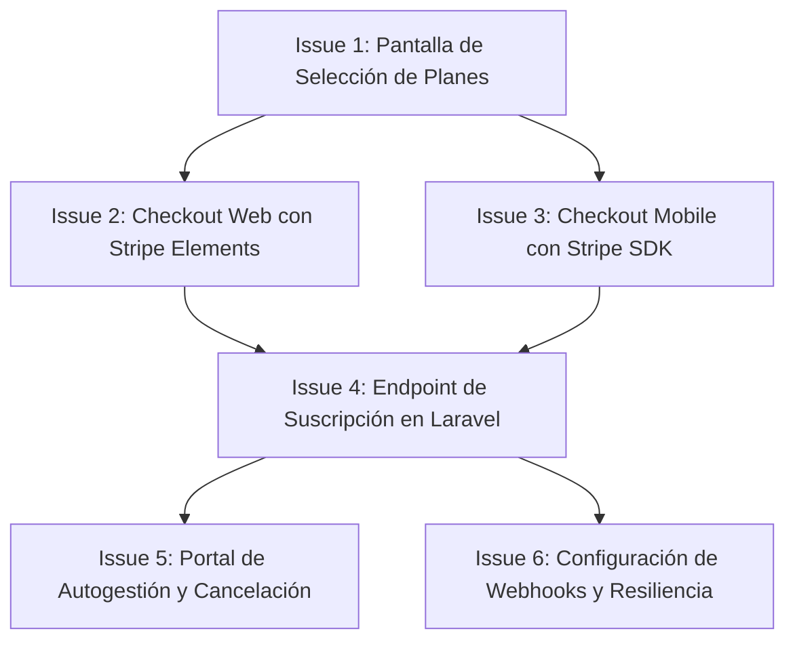

# Plan de Desarrollo: Módulo de Facturación y Suscripciones (Membresías Premium)

Este documento detalla el plan de desarrollo paso a paso (en formato de GitHub Issues) para implementar la facturación mensual recurrente mediante tarjeta de crédito en **Estoy Ok**.

La arquitectura sigue el estándar moderno de seguridad **PCI-DSS Compliance**, garantizando que los datos sensibles de las tarjetas de crédito (número, fecha, CVC) nunca pasen ni se almacenen en nuestros servidores locales. Toda captura se realiza mediante tokenización directa con las pasarelas de pago (Stripe Elements / SDKs).

---

## 📋 Lista de Issues para GitHub

### Issue 1: [FE-WEB] Diseñar la Pantalla de Selección de Planes y Pasarela de Pago
* **Tipo:** Feature / Frontend Web
* **Descripción:** 
  Crear una interfaz interactiva de planes dentro del Dashboard de Next.js (y actualizar la sección de precios de la Landing Page) para que el usuario pueda comparar el plan Gratis vs PRO Premium y seleccionar su método de pago preferido.
* **Criterios de Aceptación:**
  - Diseñar una tarjeta destacada con los beneficios Premium (historial extendido de 30 días, radares ilimitados, detección de velocidad y accidentes).
  - Incluir botones para seleccionar el método de pago:
    - **Tarjeta de Crédito (Suscripción Directa)**
    - **Mercado Pago (Checkout Redirigido)**
    - **PayPal (Checkout Redirigido)**
  - Integrar la selección de Mercado Pago y PayPal con el endpoint existente `POST /api/subscriptions/checkout`.
  - Si elige Tarjeta de Crédito, abrir la interfaz de carga de tarjeta (diseñada en el Issue 2).

---

### Issue 2: [FE-WEB] Checkout Integrado con Tarjeta de Crédito (Stripe Elements)
* **Tipo:** Feature / Frontend Web (Seguridad PCI-DSS)
* **Descripción:** 
  Confeccionar la interfaz de formulario para ingresar los datos de tarjeta de crédito dentro de la plataforma Web utilizando **Stripe Elements** (`@stripe/react-stripe-js` y `@stripe/stripe-js`).
* **Criterios de Aceptación:**
  - Cargar de manera segura el iFrame de Stripe en los campos de Número de Tarjeta, Expiración y CVC.
  - Implementar validaciones en tiempo real del lado del cliente (marca de tarjeta detectada visualmente, validación del algoritmo de Luhn, formato de fecha, etc.).
  - Realizar el proceso de tokenización al presionar "Suscribirse ahora":
    - Enviar los datos directamente a Stripe.
    - Recibir de vuelta el `payment_method_id` o token de pago seguro.
    - Si requiere verificación de seguridad bancaria adicional (3D Secure), manejar el modal emergente de autenticación bancaria provisto por Stripe.
  - Transferir únicamente el `payment_method_id` resultante al backend de Laravel para continuar el proceso.

---

### Issue 3: [FE-MOBILE] Módulo de Checkout de Tarjeta de Crédito (Stripe Mobile SDK)
* **Tipo:** Feature / Mobile App (iOS & Android)
* **Descripción:** 
  Implementar el flujo de suscripción por tarjeta de crédito en la aplicación Expo / React Native integrando el SDK móvil oficial de Stripe (`@stripe/stripe-react-native`).
* **Criterios de Aceptación:**
  - Instalar y configurar la librería `@stripe/stripe-react-native` compatible con el SDK 54 de Expo.
  - Implementar el componente `<CardField>` o el modal de pagos `<PaymentSheet>` provisto por Stripe para una integración nativa pulida.
  - Realizar la validación nativa de la tarjeta e iniciar la tokenización en el dispositivo del usuario.
  - Enviar el token seguro al backend del Laravel para culminar la suscripción.
  - Integrar soporte para flujos 3D Secure / SCA (Strong Customer Authentication) nativos.

---

### Issue 4: [BE] Endpoint para Suscripciones Directas y Tokenizadas
* **Tipo:** Feature / Backend API (Laravel Cashier)
* **Descripción:** 
  Implementar el endpoint `POST /api/subscriptions/create` en Laravel utilizando **Laravel Cashier** para procesar el token de pago seguro enviado por los frontends (Web y Mobile) y dar de alta la membresía recurrente.
* **Criterios de Aceptación:**
  - Validar el request asegurando que incluya un `payment_method_id` válido.
  - Buscar o crear el cliente en la base de datos de Stripe vinculado al usuario autenticado.
  - Adjuntar el método de pago al cliente y configurarlo como predeterminado.
  - Iniciar la suscripción recurrente mensual al plan/precio configurado en `services.php`.
  - Guardar el log transaccional del pago en la base de datos local.
  - Actualizar el campo `is_premium` a `true` en el modelo `User` y despachar el evento para limpiar la caché de las alertas del usuario en el sistema.
  - Devolver respuesta exitosa estructurada con el estado de la suscripción (`active`, `incomplete` para casos de 3DS pendiente, etc.).

---

### Issue 5: [BE/FE] Gestión y Cancelación de Membresías (Portal de Autogestión)
* **Tipo:** Feature / Web & Mobile Integration
* **Descripción:** 
  Habilitar un portal de autogestión de facturación para permitir al usuario ver su estado actual, descargar facturas históricas, actualizar su tarjeta o cancelar su membresía mensual.
* **Criterios de Aceptación:**
  - **Backend:** Crear un endpoint `GET /api/subscriptions/portal` que genere un enlace seguro al **Stripe Customer Portal** (portal pre-construido y autogestionado de Stripe).
  - **Web:** Integrar el botón "Administrar Facturación" en la sección de Ajustes del Dashboard para abrir este enlace en una nueva pestaña.
  - **Mobile:** Agregar una sección en la pantalla de Ajustes que muestre el estado de la suscripción actual (ej. *Premium activo hasta el DD/MM/AAAA*) y un botón de cancelación directa que llame al backend (`POST /api/subscriptions/cancel`) y maneje el período de gracia (Grace Period).

---

### Issue 6: [BE] Webhooks de Sincronización Automática de Pagos
* **Tipo:** Feature / Backend (Resiliencia e Integridad)
* **Descripción:** 
  Configurar y robustecer los controladores de Webhooks (Stripe, Mercado Pago, PayPal) en producción para procesar eventos recurrentes de facturación de forma asíncrona.
* **Criterios de Aceptación:**
  - Procesar el evento `invoice.payment_succeeded` de Stripe para mantener activa la membresía del usuario y renovar su fecha de vigencia.
  - Procesar los eventos `invoice.payment_failed` y `customer.subscription.deleted` de Stripe para:
    - Degradar automáticamente la cuenta a plan gratuito (`is_premium = false`).
    - Enviar un correo de aviso de pago fallido solicitando la actualización de la tarjeta de crédito.
  - Extender la misma lógica asíncrona para Mercado Pago y PayPal procesando la confirmación de débitos mensuales recurrentes en sus respectivos webhooks.
  - Incluir pruebas de integración automatizadas (`SubscriptionWebhookTest`) que emulen los payloads correspondientes simulando transacciones fallidas y exitosas.
