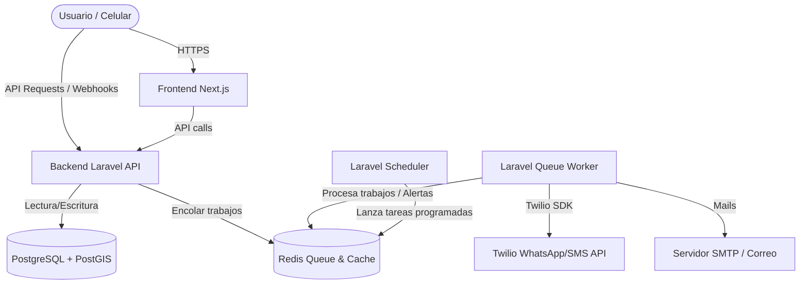

# Guía Paso a Paso: Despliegue de "Estoy Ok" en Railway

Esta guía explica detalladamente cómo desplegar la plataforma **Estoy Ok** en producción utilizando **Railway**. 

La arquitectura que desplegaremos es la siguiente:



---

## Prerrequisitos

1. **Una cuenta en GitHub:** Railway despliega directamente vinculándose a tu repositorio de GitHub. Asegúrate de tener el código del proyecto subido a un repositorio (público o privado).
2. **Cuentas de proveedores externos (API Keys):**
   * **Twilio:** Account SID, Auth Token, número de WhatsApp para alertas y número de SMS.
   * **Pasarelas de Pago:** Credenciales de producción para Mercado Pago, Stripe y PayPal.
   * **Servicio de Email:** Credenciales de SMTP (ej: SendGrid, Mailgun, Resend, o Gmail SMTP) para el envío de correos en producción (ya no usaremos Mailpit en prod).

---

## Paso 1: Crear una Cuenta en Railway

1. Ingresa a [railway.app](https://railway.app/).
2. Haz clic en **Login** (esquina superior derecha).
3. Selecciona **Sign in with GitHub**. Esto vinculará automáticamente tus repositorios para facilitar el despliegue.
4. Otorga los permisos solicitados y acepta los términos de servicio.

---

## Paso 2: Crear un Nuevo Proyecto y Bases de Datos

1. En el Dashboard de Railway, haz clic en **New Project**.
2. Selecciona **Provision PostgreSQL**. Railway creará una base de datos PostgreSQL gestionada.
3. Una vez creada, haz clic en **New** (botón de la esquina superior derecha del canvas) -> **Database** -> **Provision Redis**.
4. Ahora tendrás dos cajas en tu panel de control: una para Postgres y otra para Redis.

### Activar PostGIS en la Base de Datos
Para que funcione el rastreo de zonas seguras y ubicación, debemos habilitar la extensión espacial:
1. Haz clic en la caja de **Postgres** en tu canvas de Railway.
2. Ve a la pestaña **Data** (o utiliza la pestaña **Query** si está disponible).
3. Ejecuta la siguiente consulta SQL:
   ```sql
   CREATE EXTENSION IF NOT EXISTS postgis;
   ```
4. Haz clic en ejecutar. ¡Listo! PostGIS ya está activo.

---

## Paso 3: Desplegar el Backend Laravel API (`/backend`)

Usaremos el motor automático de Railway llamado **Nixpacks**, que detectará Laravel y configurará Nginx de forma óptima para producción.

1. En tu proyecto de Railway, haz clic en **New** -> **GitHub Repo**.
2. Selecciona tu repositorio `estoyok`.
3. Once añadida la caja, haz clic sobre ella para entrar a su configuración.
4. Ve a la pestaña **Settings**:
   * **Service Name:** Cámbialo a `backend-api` (para identificarlo fácilmente).
   * **Root Directory:** Escribe `/backend`.
5. Ve a la pestaña **Variables** y agrega las siguientes variables de entorno:

### Variables del Sistema Laravel:
* `APP_ENV`: `production`
* `APP_DEBUG`: `false`
* `APP_KEY`: *Genera una llave aleatoria de 32 caracteres y ponla en formato `base64:...` o simplemente una cadena de 32 caracteres aleatorios.*
* `APP_URL`: *Se autogenerará cuando Railway te dé un dominio, luego puedes actualizarla aquí.*
* `FRONTEND_URL`: *La URL pública del servicio `frontend-web` (ej: `https://estoyok.up.railway.app`). Es crítica para que el backend genere enlaces de emergencia válidos.*

### Enlazar Base de Datos y Redis (Variables de Referencia):
En Railway no es necesario copiar y pegar contraseñas de bases de datos. Usamos referencias automáticas:
* `DB_CONNECTION`: `pgsql`
* `DB_HOST`: `${{Postgres.DATABASE_URL}}` *(Railway conectará automáticamente el host extrayéndolo de la URL)*
  * *Nota alternativa:* Si da problemas la URL de conexión directa, puedes usar por separado:
    * `DB_HOST`: `${{Postgres.PGHOST}}`
    * `DB_PORT`: `${{Postgres.PGPORT}}`
    * `DB_DATABASE`: `${{Postgres.PGDATABASE}}`
    * `DB_USERNAME`: `${{Postgres.PGUSER}}`
    * `DB_PASSWORD`: `${{Postgres.PGPASSWORD}}`
* `REDIS_HOST`: `${{Redis.REDISHOST}}`
* `REDIS_PORT`: `${{Redis.REDISPORT}}`
* `REDIS_PASSWORD`: `${{Redis.REDISPASSWORD}}`
* `QUEUE_CONNECTION`: `redis`

### Variables de Twilio y Notificaciones:
* `TWILIO_SID`: *Tu SID de Twilio*
* `TWILIO_AUTH_TOKEN`: *Tu Token de Twilio*
* `TWILIO_WHATSAPP_FROM`: *Tu número de WhatsApp de Twilio (ej: `whatsapp:+14155238886`)*
* `TWILIO_SMS_FROM`: *Tu número de SMS de Twilio para el fallback de alertas y SOS*
* `MAIL_MAILER`: `smtp`
* `MAIL_HOST`: *Host de tu proveedor de mail de prod*
* `MAIL_PORT`: `587`
* `MAIL_USERNAME`: *Tu usuario SMTP*
* `MAIL_PASSWORD`: *Tu contraseña SMTP*
* `MAIL_ENCRYPTION`: `tls`
* `MAIL_FROM_ADDRESS`: `no-reply@estoyok.com`

### Variables de Pasarelas de Pago (Membresías PRO):
* **Stripe / Cashier:**
  * `STRIPE_KEY`: *Tu clave pública de Stripe (comienza con `pk_`)*
  * `STRIPE_SECRET`: *Tu clave secreta de Stripe (comienza con `sk_`)*
  * `STRIPE_WEBHOOK_SECRET`: *Se obtiene tras registrar el webhook de Stripe en Paso 7 (comienza con `whsec_`)*
  * `CASHIER_CURRENCY`: `USD`
* **Mercado Pago:**
  * `MERCADOPAGO_ACCESS_TOKEN`: *Tu token de acceso de producción*
  * `MERCADOPAGO_PUBLIC_KEY`: *Tu clave pública de Mercado Pago*
  * `MERCADOPAGO_APP_ID`: *Tu ID de aplicación*
* **PayPal:**
  * `PAYPAL_MODE`: `live` (o `sandbox` para entorno de pruebas)
  * `PAYPAL_LIVE_CLIENT_ID`: *Tu Client ID de producción de PayPal*
  * `PAYPAL_LIVE_CLIENT_SECRET`: *Tu Secret Key de producción de PayPal*
  * `PAYPAL_CURRENCY`: `USD`

### Configurar Comando de Migraciones y Enlaces Simbólicos:
Para automatizar la actualización de la base de datos y permitir la descarga/reproducción pública de grabaciones de audio del S.O.S. silencioso:
1. Ve a **Settings** en la configuración del servicio `backend-api`.
2. Busca la sección **Deploy** -> **Release Command**.
3. Escribe el comando:
   ```bash
   php artisan migrate --force && php artisan storage:link
   ```
   > [!NOTE]
   > El comando `php artisan storage:link` es indispensable para que los audios grabados en las alertas de S.O.S. silencioso (almacenados en `storage/app/public/audio_alerts/`) sean accesibles mediante HTTP por los navegadores en la pantalla de crisis.

4. Generar dominio público: En **Settings**, ve a la sección **Environment** -> **Generate Domain** para que la API tenga una URL pública (ej: `https://backend-api-production.up.railway.app`).

---

## Paso 4: Crear el Queue Worker de Laravel

El backend encolará alertas y correos, por lo que requerimos un servicio persistente que los procese.

1. En el canvas de tu proyecto de Railway, haz clic en **New** -> **GitHub Repo** -> Selecciona el mismo repositorio `estoyok`.
2. Entra a las propiedades del nuevo servicio.
3. Ve a **Settings**:
   * **Service Name:** Cámbialo a `backend-worker`.
   * **Root Directory:** Escribe `/backend`.
   * **Build Command:** Déjalo vacío o por defecto.
   * **Start Command:** Escribe:
     ```bash
     php artisan queue:work
     ```
4. Ve a la pestaña **Variables**:
   * Haz clic en **New Variable** -> **Share Variables From...** y selecciona `backend-api`. De esta forma, el Worker compartirá automáticamente todas las conexiones a la base de datos, Redis, Twilio y pasarelas de pago sin tener que reescribirlas.

---

## Paso 5: Crear el Scheduler de Laravel (Planificador)

El sistema de Estoy Ok verifica constantemente la inactividad de los usuarios y envía recordatorios preventivos. Para ello requerimos que el planificador de Laravel esté corriendo constantemente.

1. Haz clic en **New** -> **GitHub Repo** -> Selecciona el mismo repositorio `estoyok`.
2. Entra a las propiedades del nuevo servicio.
3. Ve a **Settings**:
   * **Service Name:** Cámbialo a `backend-scheduler`.
   * **Root Directory:** Escribe `/backend`.
   * **Start Command:** Escribe:
     ```bash
     php artisan schedule:work
     ```
4. Ve a la pestaña **Variables**:
   * Comparte las variables del servicio `backend-api` (igual que hiciste con el worker).

---

## Paso 6: Desplegar el Frontend Web (`/frontend-web`)

1. Haz clic en **New** -> **GitHub Repo** -> Selecciona tu repositorio `estoyok`.
2. Entra a las propiedades de este nuevo servicio.
3. Ve a **Settings**:
   * **Service Name:** Cámbialo a `frontend-web`.
   * **Root Directory:** Escribe `/frontend-web`.
4. Ve a **Variables** y agrega las siguientes variables de entorno:
   * `NEXT_PUBLIC_API_URL`: Escribe la URL pública que generó Railway para tu servicio `backend-api` añadiendo `/api` al final (ej: `https://backend-api-production.up.railway.app/api`).
   * `NEXT_PUBLIC_STRIPE_PUBLISHABLE_KEY`: Tu clave pública de Stripe (comienza con `pk_`) utilizada en el checkout de tarjetas con Stripe Elements.
   * `NEXT_PUBLIC_APP_ENV`: `production`
5. Genera un dominio público para este servicio: Ve a **Settings** -> **Generate Domain** (ej: `https://estoyok.up.railway.app`).

---

## Paso 7: Configurar Webhooks en Producción

Para que las respuestas SMS/WhatsApp de los usuarios y las notificaciones de pago (Stripe, Mercado Pago y PayPal) impacten en el sistema en tiempo real:

1. **Twilio Webhook:**
   * Copia la URL: `https://tu-url-del-backend.up.railway.app/api/webhooks/twilio/message`
   * En tu consola de **Twilio**, ve a la sección de números activos (o Sandbox de WhatsApp) y pega esta URL en la configuración de **"A Message Comes In" (Incoming Webhook)** en formato `POST`.

2. **Stripe Webhook:**
   * En el Dashboard de Stripe, ve a **Developers** -> **Webhooks** -> **Add Endpoint**.
   * Pega la URL: `https://tu-url-del-backend.up.railway.app/api/webhooks/stripe`
   * Selecciona los eventos necesarios para suscripciones (ej: `customer.subscription.created`, `customer.subscription.updated`, `customer.subscription.deleted`, `invoice.payment_succeeded`, etc.).
   * Copia el *Signing secret* resultante (`whsec_...`) y agrégalo como variable `STRIPE_WEBHOOK_SECRET` en el servicio `backend-api` en Railway.

3. **Mercado Pago Webhook:**
   * En tu Panel de Desarrolladores de Mercado Pago, configura una nueva integración de notificaciones IPN/Webhooks.
   * Pega la URL: `https://tu-url-del-backend.up.railway.app/api/webhooks/mercadopago`
   * Activa los tópicos relacionados con pagos y suscripciones (`payment`, `subscription_preapproval`).

4. **PayPal Webhook:**
   * En tu portal de PayPal Developer, ve a las propiedades de tu App de producción.
   * Agrega un webhook apuntando a: `https://tu-url-del-backend.up.railway.app/api/webhooks/paypal`
   * Suscríbete a eventos de cobro recurrente (ej: `BILLING.SUBSCRIPTION.CREATED`, `BILLING.SUBSCRIPTION.CANCELLED`, `PAYMENT.SALE.COMPLETED`).

---

## 💡 Consejos de Mantenimiento y Limitaciones

> [!IMPORTANT]
> **Almacenamiento Efímero de Railway:** 
> Los servidores en Railway son efímeros (stateless). Cualquier archivo local (como los audios de 15 segundos subidos en emergencias) se eliminará de forma permanente al redesplegar la app o reiniciarse el contenedor de la API. Dado que las alertas de Estoy Ok expiran de forma natural pasadas las 48 horas, esto es aceptable para el MVP. Sin embargo, para producción a gran escala, se recomienda configurar el disco `public` de Laravel para que guarde los audios en un servicio de almacenamiento en la nube permanente (como AWS S3, Cloudinary o MinIO).

> [!NOTE]
> **Cero inactividad (Cold Starts):** A diferencia de las capas gratuitas de Render o Heroku, los contenedores en Railway no se duermen por inactividad. Tu API de bienestar responderá de inmediato ante alertas críticas o geofencing en segundo plano.

> [!TIP]
> **Monitoreo de Logs y Consola:** Si necesitas sembrar la base de datos con un usuario administrador para Filament, puedes entrar a la pestaña **Deployments** del servicio `backend-api` en Railway, abrir la consola web y ejecutar manualmente:
> ```bash
> php artisan db:seed
> ```
> O también para monitorizar las colas del `backend-worker` usando:
> ```bash
> php artisan queue:monitor
> ```