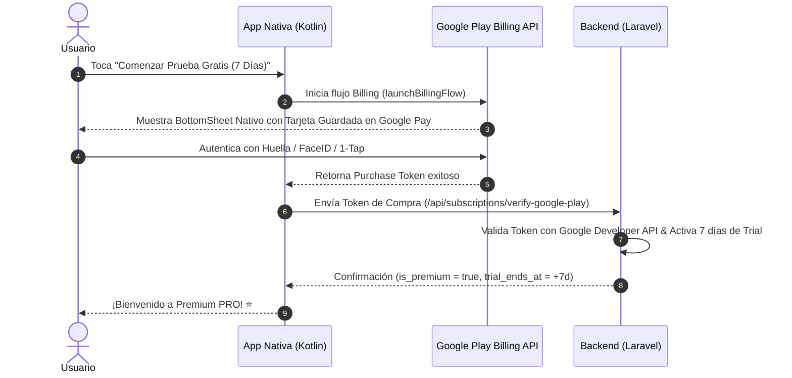
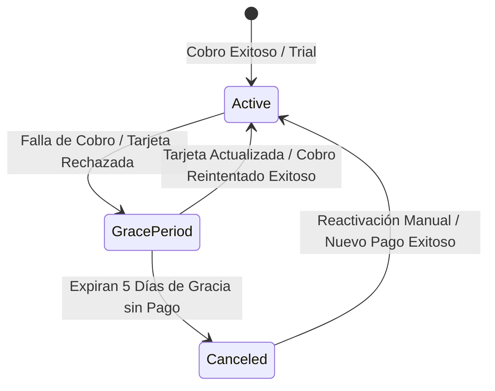

# 👑 Análisis de Suscripciones Premium (Estilo Life360) y Plan de Desarrollo para Estoy Ok

Este documento presenta un **análisis integral del modelo de monetización y conversión de Life360**, junto con un **plan de desarrollo ultra detallado** para implementar una experiencia de suscripción fluida, de alta conversión y 100% nativa en la plataforma **Estoy Ok**.

---

## 📑 PARTE 1: Análisis de Estrategia de Suscripción en Life360

Life360 es el referente global en monetización freemium para seguridad familiar. Su éxito se basa en reducir la fricción en la compra, comunicar paz mental en lugar de características técnicas y ofrecer un periodo de prueba sin riesgo.

### 1.1 Estrategia de Comunicación y Paywalls Contextuales
Life360 no espera a que el usuario visite la sección de Ajustes para venderle la suscripción. Utiliza **Paywalls Contextuales (Triggers de Valor)**:

| Evento / Acción del Usuario | Disparador de Conversión (Paywall) | Propuesta de Valor (Copy Emocional) |
| :--- | :--- | :--- |
| **Intento de ver historial pasados 24h** | Candado interactivo en la línea de tiempo. | *"¿Dónde estuvieron ayer? Desbloquea 30 días de historial de rutas de tus hijos."* |
| **Detección de tramo vehicular** | Banner de velocidad o frenada brusca. | *"Detectamos una aceleración rápida. Conoce el score de conducción semanal de tu familia."* |
| **Límite de Zonas Seguras** | Intento de agregar la 3ra Zona Segura. | *"Zonas ilimitadas: recibe alertas cuando lleguen al colegio, club o trabajo."* |
| **SOS o Emergencia** | Notificación tras finalizar un reporte. | *"SOS con grabación ambiental de 15s e interconexión prioritaria a contactos."* |

#### 1.1.1 Cuadro Comparativo Formal de Ventajas (Free vs Premium PRO)

Tanto en la Web como en la App Móvil, el sistema presenta una matriz clara de diferencias para que el usuario perciba de inmediato el valor de pasarse a Premium:

| Funcionalidad / Beneficio | Plan Gratuito (FREE) 🛡️ | Plan Premium PRO 👑 (7 Días Gratis, luego $4.99/mes) |
| :--- | :--- | :--- |
| **Integrantes del Núcleo** | Sin límite | Sin límite |
| **Frecuencia de Rastreo GPS** | Frecuencia estándar (15s a 30s) | **Alta Frecuencia (5s en vehículo, 30s caminando)** |
| **Historial de Rutas y Viajes** | **Últimas 24 Horas** | **Últimos 30 Días** (con reproducción interactiva) |
| **Zonas Seguras (Geocercas)** | Hasta 2 Zonas Seguras | **Zonas Seguras Ilimitadas** con Alertas de Entrada/Salida |
| **Canales de Alerta de Inactividad** | Email y Notificaciones Push | **Email, Push, WhatsApp Automatizado y SMS Directo** |
| **S.O.S. de Emergencia** | Notificación Push Estándar | **S.O.S. Silencioso con 15s de Grabación Ambiente + Rastro Crítico (5s)** |
| **Protección Vehicular** | Resumen Semanal básico | **Telemetría Completa: Velocidad, Excesos, Frenadas Bruscas y Celular** |
| **Detección de Accidentes (Crash)** | Desactivado | **Detección de Colisiones por Acelerómetro con Sirena y Alerta Automática** |
| **Alertas de Batería Baja & Sensores** | Básico | **Alertas prioritarias de Batería Baja (<15%), GPS Desactivado y Modo Avión** |
| **Alertas de Proximidad Relativa** | Desactivado | **Radar Móvil de Proximidad entre Miembros** |

---

### 1.2 Métodos de Pago y Reducción de Fricción (Google Play Billing / 1-Tap Buy)
La tasa de conversión en móviles depende del número de toques necesarios para pagar:



* **Sin escribir formularios cuando ya tiene tarjeta:** Se aprovecha la tarjeta ya guardada en la cuenta de Google (`Google Pay`) para confirmar en 1 toque.
* **Ingreso de Nueva Tarjeta en Google Play:** Si el usuario no desea usar la tarjeta predeterminada guardada en Google Pay, el propio diálogo nativo de Google Play le permite seleccionar **"Agregar nueva tarjeta de crédito o débito"** sin salir de la app. La nueva tarjeta queda enlazada a su cuenta de Google Pay para futuros cobros.
* **1-Tap Authentication:** La compra se confirma en **menos de 3 segundos** mediante biometría (Huella / FaceID).
* **Ingreso Directo de Tarjeta / Medios Alternativos (Stripe / Mercado Pago / PayPal):** Para usuarios que prefieran no utilizar Google Play o deseen ingresar una nueva tarjeta de crédito/débito directamente en nuestro backend sin guardarla en Google, el formulario de pago incluye el selector alternativo **"Tarjeta de Crédito / Débito (Stripe / Mercado Pago)"**.

#### 1.2.1 Diversidad de Medios de Pago Soportados:
No nos limitamos a tarjetas de crédito. El sistema contempla formalmente:
1. **Tarjetas de Débito Nativas e Internacionales** (Visa Débito, Maestro, Mastercard Débito).
2. **Tarjetas de Crédito** (Visa, Mastercard, Amex, Cabal, Naranja, etc.).
3. **Billeteras Virtuales y Saldo en Cuenta:**
   * **Mercado Pago (Saldo en Cuenta / CVU):** Disponible nativamente tanto por Google Play como por nuestro SDK de Mercado Pago.
   * **PayPal (Saldo o Cuenta Bancaria):** Para pagos internacionales sin tarjeta.
4. **Facturación a la Factura Telefónica (Carrier Billing):** Cobro directo en la factura de la compañía celular (Personal, Movistar, Claro, etc.) gestionado automáticamente por Google Play Billing.
5. **Tarjetas de Regalo y Saldo Google Play:** Uso de saldo prepago de Gift Cards de Google Play.

#### 1.2.2 Naturaleza del Cobro Recurrente (Automatización vs Interacción del Usuario):
* **El cobro es 100% AUTOMÁTICO e INVISIBLE:** Todas las modalidades mencionadas (Google Play Billing, Stripe, Mercado Pago Suscripciones y PayPal) operan bajo el esquema de **débito automático mensual recurrente**. Una vez autorizada la prueba o la suscripción inicial, el usuario **NO necesita realizar ninguna acción manual cada mes para pagar**. El dinero se debita automáticamente de su tarjeta, saldo de Mercado Pago, o factura celular.
* **¿Cuándo interviene el usuario? Únicamente por Excepción o Transparencia:**
  1. **Recordatorio Preventivo de Transparencia (Día 5 del Trial):** Notificación Push/Email informativa. El usuario no debe hacer nada si quiere continuar; solo interactúa si desea cancelar antes de que comience el cobro.
  2. **Cobro Fallido / Tarjeta Vencida:** Si el débito automático se rechaza el día del cobro (por falta de fondos o tarjeta vencida), el sistema activa el **Periodo de Gracia** y le envía una Push: *"Tu pago mensual falló. Actualiza tu medio de pago aquí para mantener la protección familiar"*.
  3. **Reintento de Billeteras Virtuales sin Saldo:** Si el usuario paga con Saldo Mercado Pago y no tiene dinero disponible ese día, se le notifica para que recargue saldo en su billetera.

---

### 1.3 Pruebas Gratuitas (*7-Day Free Trial*) y Cobro Automático
Life360 utiliza el modelo **"Prueba antes de pagar"**:

> [!IMPORTANT]
> **Mecánica del Trial:**
> 1. **Monto inicial $0.00:** El usuario no paga nada el día 1.
> 2. **7 Días de Acceso PRO Total:** Desbloqueo inmediato de todas las características Premium.
> 3. **Cobro Automático en el Día 8:** Al finalizar el día 7, la plataforma cobra automáticamente la mensualidad a la tarjeta guardada.
> 4. **Cancelación Abierta:** El usuario puede cancelar en cualquier momento durante los 7 días desde los Ajustes o desde Google Play sin que se le efectúe ningún cobro.

#### Notificaciones Preventivas de Transparencia (Generación de Confianza):
Para evitar contracargos (*chargebacks*) y reseñas negativas en la tienda, el sistema envía notificaciones proactivas:
* **Día 5 (Faltan 2 días):** Push Notification: *"Tu prueba gratuita de Estoy Ok finaliza en 2 días. Puedes continuar disfrutando la tranquilidad PRO o cancelar sin costo."*
* **Día 7 (Mañana cobra):** Email + Push: *"Mañana comienza tu suscripción mensual ($4.99/mes). Cancela hoy si no deseas continuar."*

---

### 1.4 Retención, Ciclo de Vida y Prevención de Cancelaciones
1. **Surveys de Cancelación (Offboarding):** Al tocar "Cancelar suscripción", se despliega un micro-survey:
   * *"Es muy caro"* $\rightarrow$ Oferta de descuento del 50% por los próximos 3 meses.
   * *"Ya no lo necesito"* $\rightarrow$ Recordatorio visual de la protección activa del grupo familiar.
   * *"Fallos técnicos"* $\rightarrow$ Enlace directo a soporte prioritario.
2. **Periodo de Gracia (*Grace Period* de 3 a 7 días):** Si la tarjeta del usuario vence o se rechaza en el cobro recurrente:
   * El usuario **no pierde el acceso de inmediato**.
   * Se le otorga un periodo de gracia con notificaciones Push diarias: *"Tu medio de pago falló. Actualízalo para no perder la protección vehicular y SOS."*

---

### 1.5 Flujo de Liquidación de Fondos a tu Cuenta Bancaria (Payouts)

El dinero recolectado por las suscripciones llega directamente a tu **cuenta bancaria personal o de empresa** a través del flujo automático de cada procesador:

| Procesador de Pago | Dónde se recibe la recaudación | Cómo y cuándo llega a tu Cuenta Bancaria (Payout) |
| :--- | :--- | :--- |
| **Google Play Billing** | Consola de Google Play Merchant Center. | **Transferencia Bancaria directa (CBU/ALIAS / SWIFT)** programada automáticamente el 15 de cada mes. Google descuenta su comisión (15%) y transfiere el neto acumulado a tu banco. |
| **Mercado Pago (AR / Latam)** | Tu cuenta de Mercado Pago (Vendedor). | **Disponible al instante / 14 días.** Desde la app de Mercado Pago puedes transferir en 1 toque mediante CBU/CVU/ALIAS a tu banco, o dejarlo invertido. |
| **Stripe (Internacional)** | Tu panel de Stripe Dashboard. | **Transferencias automáticas diarias o semanales (*Payouts*)** directamente a tu cuenta bancaria vinculada en USD, EUR o moneda local. |
| **PayPal (Global)** | Tu cuenta PayPal Business. | **Transferencia bajo demanda o semanal** a tu cuenta bancaria asociada (o a través de retiro local Nubi/Macro). |

---

## 📐 PARTE 2: Modelo de Datos y Arquitectura para Estoy Ok

### 2.1 Cambios en Base de Datos (Backend Laravel)

Se extenderán las migraciones y modelos existentes para soportar el ciclo de vida completo de pruebas y facturación nativa:

```sql
-- Extensión de la tabla users
ALTER TABLE users ADD COLUMN trial_ends_at TIMESTAMP NULL;
ALTER TABLE users ADD COLUMN subscription_provider VARCHAR(50) DEFAULT 'stripe'; -- 'stripe', 'google_play', 'mercadopago', 'paypal'
ALTER TABLE users ADD COLUMN subscription_id VARCHAR(255) NULL;
ALTER TABLE users ADD COLUMN subscription_status VARCHAR(50) DEFAULT 'inactive'; -- 'trialing', 'active', 'past_due', 'canceled', 'grace_period'
ALTER TABLE users ADD COLUMN billing_cycle_ends_at TIMESTAMP NULL;
ALTER TABLE users ADD COLUMN trial_reminder_sent_at TIMESTAMP NULL;
```

---

## 🛠️ PARTE 3: Plan de Desarrollo Ultra Detallado (Paso a Paso)

---

### FASE 1: Paywall Rediseñado y Promoción del Trial de 7 Días (Nativo & Web)
> **Objetivo:** Transformar la pantalla Premium en un embudo de alta conversión con prueba gratis por 7 días y propuesta de valor emocional.

- [x] **Tarea 1.1: Diseñar la UI del Paywall Estilo Life360 en Android Native (`PremiumScreen.kt`)**
  - [x] Agregar cabecera hero animada: *"Prueba Estoy Ok PRO gratis por 7 días"*.
  - [x] Diseñar el desglose del timeline de prueba:
    * **Hoy:** Acceso inmediato a todas las características PRO ($0.00).
    * **Día 5:** Te enviamos un recordatorio por notificación push.
    * **Día 7:** Comienza el cobro mensual ($4.99/mes). Cancela cuando quieras.
  - [x] Crear el selector de facturación (Anual con 40% OFF vs Mensual).
  - [x] Implementar la lista/matriz comparativa interactiva de características Free vs PRO con íconos turquesa.

- [x] **Tarea 1.2: Rediseñar Paywalls Contextuales en la App (Triggers)**
  - [x] Actualizar el diálogo promocional de Historial en `MapaScreen.kt` con botón directo *"Iniciar Prueba Gratis por 7 Días"*.
  - [x] Agregar Paywall contextual en la solapa `VehiculoScreen.kt` al intentar ver trayectos pasados.
  - [x] Agregar Paywall contextual en `AjustesScreen.kt` con tarjeta descriptiva de suscripción y acceso a la prueba de 7 días.

- [x] **Tarea 1.3: Sincronizar Comunicación de Planes y Ventajas en la Plataforma Web (`frontend-web`)**
  - [x] Actualizar la página comercial de planes (`/pricing` / `/premium` en Next.js) with la tabla comparativa interactiva Free vs PRO.
  - [x] Integrar el banner promocional de 7 días gratis en el header y footer de la Landing Page (`page.tsx`).
  - [x] Actualizar las FAQs con acordeón interactivo respondiendo las dudas frecuentes sobre el periodo de prueba y cancelación.
  - [x] Agregar la comunicación del 7-Day Free Trial ($0.00 hoy, cobro desde Día 8) en `BillingSection.tsx`.

---

### FASE 2: Backend & Lógica de Ciclo de Vida del Trial de 7 Días
> **Objetivo:** Extender la API de Laravel para gestionar el estado de prueba, cálculo de días restantes y accesores globales.

- [ ] **Tarea 2.1: Migraciones y Accesores del Modelo `User.php`**
  - [ ] Crear migración `add_subscription_lifecycle_to_users_table`.
  - [ ] Agregar accesores dinámicos en `User.php`:
    * `is_on_trial`: retorna `true` si `trial_ends_at` es futuro.
    * `is_premium`: retorna `true` si `is_on_trial == true` O `subscription_status == 'active'` O `subscription_status == 'grace_period'`.
    * `trial_days_left`: retorna los días enteros restantes de la prueba.
  - [ ] Actualizar el endpoint `GET /api/user` (Auth/Me) para retornar estos campos en la respuesta JSON.

- [ ] **Tarea 2.2: Endpoint de Inicio de Trial Gratis (`POST /api/subscriptions/start-trial`)**
  - [ ] Validar que el usuario no haya consumido previamente una prueba gratis.
  - [ ] Asignar `trial_ends_at = now()->addDays(7)` y `subscription_status = 'trialing'`.
  - [ ] Escribir tests de integración en `SubscriptionTrialTest.php`.

---

### FASE 3: Integración de Google Play Billing SDK (1-Tap Google Pay en Android)
> **Objetivo:** Permitir compras y pruebas gratuitas nativas de 1 toque usando las tarjetas guardadas en la cuenta de Google del teléfono.

- [ ] **Tarea 3.1: Configuración de Google Play Billing Library en Kotlin (`build.gradle.kts`)**
  - [ ] Añadir la dependencia `com.android.billingclient:billing-ktx:6.1.0`.
  - [ ] Crear la clase cliente `GooglePlayBillingManager.kt` utilizando Hilt DI.
  - [ ] Implementar la consulta de productos/suscripciones (`queryProductDetailsAsync`) y el lanzamiento del flujo de pago (`launchBillingFlow`).

- [ ] **Tarea 3.2: Endpoint de Verificación Backend (`POST /api/subscriptions/verify-google-play`)**
  - [ ] Instalar paquete `google/apiclient` en Laravel.
  - [ ] Implementar verificación de compras de Google Play Android Publisher API (`purchases.subscriptions.get`).
  - [ ] Sincronizar el estado de la suscripción y token de compra en la base de datos.
  - [ ] Cubrir con pruebas automatizadas con mocks de Google API.

---

### FASE 4: Notificaciones Preventivas del Trial y Retención
> **Objetivo:** Notificar proactivamente al usuario antes del cobro para construir confianza y reducir contracargos.

- [ ] **Tarea 4.1: Comando de Scheduler `subscriptions:send-trial-reminders`**
  - [ ] Buscar usuarios en estado `trialing` cuyo `trial_ends_at` venza en exactamente 2 días (Día 5 de la prueba).
  - [ ] Enviar Notificación Push prioritaria y Email `TrialExpiringSoonMail`.
  - [ ] Marcar `trial_reminder_sent_at = now()` para evitar duplicados.
  - [ ] Programar la ejecución diaria en el Scheduler de Laravel.

- [ ] **Tarea 4.2: Centro de Gestión de Suscripción en Ajustes (`AjustesScreen.kt`)**
  - [ ] Diseñar la tarjeta de estado de facturación activa:
    * Muestra: *"Prueba Gratuita Activa (Quedan 3 días)"* o *"Plan PRO Activo (Próximo cobro: 15 de Agosto)"*.
    * Muestra medio de pago vinculado (Google Pay / Visa ****1234).
  - [ ] Botón de gestión *"Modificar Medio de Pago / Cancelar Suscripción"*.
  - [ ] Integrar el diálogo modal de encuestas de retención (*Cancellation Survey*) previo a redirigir a la cancelación.

---

### FASE 5: Protocolo Completo de Manejo de Errores de Pago, Reintentos y Reversión a Plan Free
> **Objetivo:** Garantizar que si un pago falla por tarjeta vencida o falta de fondos, la app gestione la falla en 4 etapas sin cortar la protección de inmediato, avisando al usuario y revirtiendo a Free únicamente si la deuda no se regulariza.



- [ ] **Tarea 5.1: Captura de Webhooks de Falla (Stripe, Google Play & Mercado Pago)**
  - [ ] Capturar `invoice.payment_failed` y `customer.subscription.past_due` en Stripe Webhook.
  - [ ] Capturar `SUBSCRIPTION_IN_GRACE_PERIOD` y `SUBSCRIPTION_ON_HOLD` en Google Play Developer Notifications.
  - [ ] Capturar estado de preapproval rechazado en Mercado Pago Webhook.
  - [ ] Actualizar estado del usuario a `subscription_status = 'grace_period'` y registrar `grace_period_ends_at = now()->addDays(5)`.

- [ ] **Tarea 5.2: Notificaciones y Reintentos Inteligentes en Periodo de Gracia**
  - [ ] Despachar Notificación Push inmediata + Email `PaymentFailedGracePeriodMail`:
    * *"Tu pago mensual no pudo procesarse. Tu grupo familiar seguirá protegido durante 5 días de gracia. Toca aquí para actualizar tu tarjeta."*
  - [ ] Programar Push de recordatorio en el Día 3 del Periodo de Gracia.
  - [ ] El accesor `is_premium` se mantiene en `true` durante los 5 días de gracia para no dejar desprotegida a la familia.

- [ ] **Tarea 5.3: Expiración de Gracia y Reversión Automática a Plan Free**
  - [ ] Comando de Scheduler `subscriptions:check-expired-grace-periods`.
  - [ ] Buscar usuarios en `grace_period` cuyo `grace_period_ends_at` haya vencido.
  - [ ] Transicionar estado a `subscription_status = 'canceled'` y `is_premium = false`.
  - [ ] Enviar Notificación Push + Email `SubscriptionSuspendedMail`: *"Tu suscripción ha vencido y los beneficios PRO se han pausado. Tu familia cuenta ahora con el Plan Gratuito. Toca para reactivar."*

- [ ] **Tarea 5.4: Flujo de Reactivación Instantánea**
  - [ ] Al ingresar a Ajustes o tocar la notificación de suspensión, desplegar la tarjeta *"Reactivar Estoy Ok PRO"* pre-completada.
  - [ ] Al actualizar tarjeta o pagar, transicionar de inmediato a `subscription_status = 'active'`, `is_premium = true` y restablecer el tracking continuo, SOS y telemetría.

---

## 🧪 Estrategia de Verificación y Cero Regresiones

1. **Suite de Pruebas Automatizadas:**
   - Ejecutar `docker compose exec backend php artisan test` para validar que los accesores de `is_premium` no rompan los permisos existentes de trayectos, excesos de velocidad o SOS.
2. **Compilación Nativa:**
   - Compilación continua mediante `./gradlew assembleDebug` asegurando 0 errores de compilación en Kotlin.
3. **Preservación Estricta:**
   - Garantizar que los usuarios con suscripciones vigentes creadas mediante Stripe o Mercado Pago conserven su acceso sin interrupciones.

---

## 🎯 Resultado Esperado
Al finalizar la ejecución de este plan, **Estoy Ok** contará con la misma infraestructura de monetización y conversión que **Life360**:
* Compras nativas de **1 toque con Google Pay / Apple Pay**.
* **Prueba gratis por 7 días** con cobro automático posterior.
* **Paywalls emocionales y contextually distribuidos** en los puntos de mayor interés del usuario.
* **Transparencia total con notificaciones preventivas** en el día 5.
* **Gestión transparente de cobros fallidos y periodo de gracia**.
